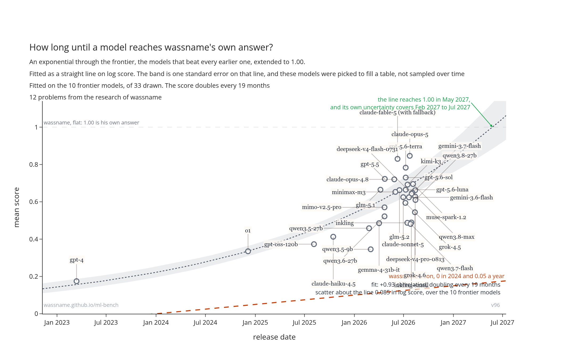

<!-- Text before the first heading sits above the chart on the page. Every section below it sits
     under the table, so the chart stays near the top. -->

# wassname-ml-bench

Which machine learning model should you work with? This bench asks twelve questions from
[wassname](https://wassname.org)'s own research and scores each answer against the one he reached at
the time, so 1.00 is his answer. The work is obscure and some of it is newer than the models, which
means a model has to work the answer out rather than recall it.

## Score against cost

### Table: wassname-ml-bench

12 problems from the research of [wassname](https://wassname.org). The best model scores
0.85, where 1.00 is wassname's own answer.

| model                          |   score↑ | +-     | answered   |   answers/q |      $/run↓ |   ktok↓ |   pts/Mtok↑ |   AP#1↑ |   CW#2↑ |   KL#3↑ |   MC#4↑ |   NP#5↑ |   OL#6↑ |   PC#7↑ |   SV#8↑ |   TR#9↑ |   TS#10↑ |   VG#11↑ |   VJ#12↑ |
|:-------------------------------|------------------:|:-------|:-----------------------|------------:|------------:|----------------:|------------------------:|----------------------------:|---------------------------------:|-----------------------------:|---------------------:|----------------------:|--------------------------:|----------------------:|-----------------------:|-----------------------:|------------------------------:|--------------------------------:|----------------------:|
| claude-opus-5                  |         **+0.85** | ±0.047 | 12/12                  |           3 |       $0.80 |            30.1 |                      28 |                   **+0.71** |                        **+0.90** |                        +0.62 |            **+0.96** |             **+1.02** |                 **+1.14** |                 +0.74 |                  +0.84 |                  +0.60 |                         +0.87 |                       **+0.78** |             **+0.96** |
| claude-fable-5 (with fallback) |         **+0.83** | ±0.055 | 11/12                  |           1 |        $1.0 |            18.6 |                      45 |                   **+0.70** |                            +0.81 |                    **+0.94** |                +0.46 |                 +0.96 |                 **+1.11** |                 +0.68 |                *+0.84* |                  +1.11 |                         +0.76 |                           +0.66 |             **+0.93** |
| gpt-5.6-terra                  |         **+0.78** | ±0.053 | 12/12                  |           3 |       $0.52 |            42.1 |                      19 |                   **+0.70** |                            +0.47 |                    **+0.97** |                +0.65 |                 +0.97 |                     +1.01 |                 +0.70 |                  +0.77 |                  +0.56 |                     **+1.01** |                           +0.70 |                 +0.88 |
| gpt-5.6-sol                    |             +0.73 | ±0.089 | 12/12                  |           3 |       $0.39 |            25.2 |                      29 |                       +0.64 |                            -0.12 |                        +0.89 |                +0.69 |             **+1.01** |                     +1.06 |                 +0.71 |                  +0.86 |                  +0.55 |                         +0.92 |                           +0.68 |                 +0.87 |
| gpt-5.5                        |             +0.72 | ±0.063 | 12/12                  |           1 |       $0.96 |            30.7 |                      24 |                   **+0.69** |                            +0.74 |                        +0.70 |                +0.27 |             **+1.01** |                 **+1.13** |                 +0.60 |                  +0.62 |                  +0.57 |                         +0.84 |                       **+0.79** |                 +0.71 |
| claude-opus-4.8                |             +0.72 | ±0.102 | 12/12                  |           1 |       $0.75 |            27.7 |                      26 |                   **+0.73** |                            +0.04 |                        +0.88 |                +0.12 |             **+1.01** |                 **+1.11** |             **+0.87** |                  +0.67 |              **+1.18** |                         +0.86 |                           +0.61 |                 +0.57 |
| muse-spark-1.2                 |             +0.70 | ±0.070 | 12/12                  |           3 |       $0.11 |            24.5 |                      28 |                       +0.66 |                            +0.65 |                        +0.67 |                +0.16 |                 +0.92 |                 **+1.11** |                 +0.54 |              **+0.87** |                  +0.48 |                         +0.71 |                           +0.73 |                 +0.84 |
| kimi-k3                        |             +0.69 | ±0.073 | 12/12                  |           3 |       $0.52 |            32.8 |                      21 |                       +0.48 |                            +0.32 |                        +0.85 |                +0.33 |             **+1.03** |                     +1.08 |                 +0.73 |                  +0.65 |                  +0.50 |                         +0.80 |                           +0.63 |             **+0.91** |
| glm-5.1                        |             +0.66 | ±0.082 | 12/12                  |           1 |       $0.40 |             131 |                       5 |                   **+0.73** |                            +0.19 |                        +0.51 |                +0.11 |                 +0.89 |                 **+1.11** |                 +0.66 |              **+0.92** |                  +0.64 |                         +0.76 |                           +0.71 |                 +0.74 |
| gpt-5.6-luna                   |             +0.66 | ±0.094 | 12/12                  |           3 |      $0.028 |            22.2 |                      30 |                       +0.65 |                            -0.06 |                        +0.89 |                +0.18 |                 +0.97 |                     +1.01 |                 +0.64 |                  +0.71 |                  +0.58 |                         +0.89 |                           +0.58 |             **+0.94** |
| glm-5.2                        |             +0.66 | ±0.067 | 12/12                  |           3 |       $0.60 |             157 |                       4 |                       +0.65 |                            +0.50 |                        +0.52 |                +0.21 |                 +0.90 |                 **+1.09** |                 +0.63 |                  +0.67 |                  +0.58 |                         +0.75 |                           +0.52 |             **+0.93** |
| gemini-3.7-flash               |             +0.66 | ±0.071 | 12/12                  |           3 |      $0.035 |            17.0 |                      39 |                       +0.64 |                            +0.40 |                        +0.76 |                +0.17 |                 +0.91 |                     +1.06 |                 +0.67 |                  +0.64 |                  +0.53 |                         +0.69 |                           +0.53 |             **+0.93** |
| minimax-m3                     |             +0.65 | ±0.078 | 12/12                  |           3 |       $0.22 |             182 |                       4 |                   **+0.72** |                            +0.22 |                        +0.58 |                +0.15 |                 +0.97 |                     +1.05 |                 +0.69 |                  +0.60 |                  +0.50 |                         +0.76 |                       **+0.83** |                 +0.77 |
| qwen3.8-max                    |             +0.65 | ±0.071 | 12/12                  |           3 |       $0.51 |            82.5 |                       8 |                   **+0.72** |                            +0.24 |                        +0.68 |                +0.19 |                 +0.90 |                     +1.01 |                 +0.64 |                  +0.80 |                  +0.57 |                         +0.74 |                           +0.48 |                 +0.80 |
| deepseek-v4-flash-0731         |             +0.64 | ±0.070 | 12/12                  |           3 |      $0.046 |             163 |                       4 |                       +0.66 |                            +0.11 |                        +0.70 |                +0.31 |                 +0.90 |                     +1.02 |                 +0.65 |                  +0.75 |                  +0.67 |                         +0.71 |                           +0.53 |                 +0.73 |
| deepseek-v4-pro-0813           |             +0.63 | ±0.065 | 12/12                  |           3 |       $0.63 |             157 |                       4 |                       +0.63 |                            +0.41 |                        +0.68 |                +0.17 |                 +0.95 |                     +1.05 |                 +0.58 |                  +0.66 |                  +0.55 |                         +0.62 |                           +0.57 |                 +0.67 |
| claude-sonnet-5                |             +0.62 | ±0.071 | 12/12                  |           3 |       $0.30 |            27.4 |                      23 |                   **+0.70** |                            +0.23 |                        +0.73 |                +0.13 |                 +0.93 |                     +1.01 |                 +0.64 |                  +0.58 |                  +0.58 |                         +0.67 |                           +0.66 |                 +0.65 |
| gemini-3.6-flash               |             +0.62 | ±0.059 | 12/12                  |           3 |      $0.077 |            18.9 |                      33 |                       +0.65 |                            +0.24 |                        +0.55 |                +0.48 |                 +0.81 |                     +1.02 |                 +0.65 |                  +0.49 |                  +0.51 |                         +0.66 |                           +0.56 |                 +0.86 |
| qwen3.8-27b                    |             +0.61 | ±0.073 | 12/12                  |           3 |       $0.32 |            99.3 |                       6 |                   **+0.71** |                            +0.15 |                        +0.60 |                +0.24 |                 +0.88 |                 **+1.09** |                 +0.63 |                  +0.57 |                  +0.46 |                         +0.68 |                           +0.59 |                 +0.70 |
| grok-4.5                       |             +0.59 | ±0.092 | 12/12                  |           1 |       $0.12 |            17.5 |                      34 |                   **+0.72** |                            -0.05 |                        +0.66 |                +0.18 |                 +0.82 |                     +1.06 |                 +0.46 |                  +0.54 |                  +0.89 |                         +0.75 |                           +0.31 |                 +0.80 |
| mimo-v2.5-pro                  |             +0.57 | ±0.076 | 12/12                  |           2 |       $0.13 |             149 |                       4 |                   **+0.70** |                            +0.01 |                        +0.48 |                +0.34 |                 +0.87 |                     +0.96 |                 +0.58 |                  +0.71 |                  +0.45 |                         +0.61 |                           +0.37 |                 +0.77 |
| grok-4.6                       |             +0.54 | ±0.075 | 12/12                  |           3 |       $0.12 |            17.3 |                      31 |                       +0.63 |                            -0.02 |                        +0.46 |                +0.13 |                 +0.78 |                     +0.87 |                 +0.59 |                  +0.60 |                  +0.62 |                         +0.64 |                           +0.48 |                 +0.76 |
| qwen3.6-27b                    |             +0.52 | ±0.075 | 12/12                  |           1 |       $0.24 |             101 |                       5 |                       +0.30 |                            +0.00 |                        +0.38 |                +0.28 |             **+0.99** |                     +0.76 |                 +0.65 |                  +0.45 |                  +0.66 |                         +0.67 |                           +0.56 |                 +0.57 |
| inkling-small                  |             +0.49 | ±0.076 | 12/12                  |           3 |      $0.016 |            10.5 |                  **47** |                       +0.36 |                            -0.03 |                        +0.40 |                +0.07 |                 +0.83 |                     +0.86 |                 +0.63 |                  +0.53 |                  +0.53 |                         +0.59 |                           +0.53 |                 +0.59 |
| inkling                        |             +0.49 | ±0.079 | 12/12                  |           3 |      $0.056 |            12.1 |                      40 |                       +0.41 |                            -0.08 |                        +0.43 |                +0.11 |                 +0.80 |                     +0.90 |                 +0.61 |                  +0.39 |                  +0.64 |                         +0.65 |                           +0.49 |                 +0.49 |
| gemma-4-31b-it                 |             +0.49 | ±0.073 | 12/12                  |           3 |      $0.016 |            45.9 |                      11 |                       +0.56 |                            +0.10 |                        +0.45 |                +0.16 |                 +0.85 |                     +0.96 |                 +0.58 |                  +0.41 |                  +0.54 |                         +0.49 |                           +0.21 |                 +0.52 |
| qwen3.7-flash                  |             +0.48 | ±0.075 | 12/12                  |           3 |      $0.013 |            97.8 |                       5 |                       +0.33 |                            +0.01 |                        +0.39 |                +0.14 |                 +0.79 |                     +0.94 |                 +0.60 |                  +0.45 |                  +0.40 |                         +0.62 |                           +0.46 |                 +0.63 |
| qwen3.5-27b                    |             +0.46 | ±0.078 | 12/12                  |           1 |       $0.14 |            89.5 |                       5 |                       +0.33 |                            -0.06 |                        +0.45 |                +0.11 |                 +0.59 |                     +1.02 |                 +0.47 |                  +0.38 |                  +0.56 |                         +0.51 |                           +0.50 |                 +0.63 |
| claude-haiku-4.5               |             +0.41 | ±0.066 | 12/12                  |           3 |       $0.18 |            33.7 |                      12 |                       +0.58 |                            -0.05 |                        +0.45 |                +0.12 |                 +0.50 |                     +0.85 |                 +0.55 |                  +0.47 |                  +0.45 |                         +0.31 |                           +0.40 |                 +0.32 |
| gpt-oss-120b                   |             +0.37 | ±0.061 | 12/12                  |           3 | **$0.0050** |            28.2 |                      13 |                       +0.58 |                            -0.01 |                        +0.48 |                +0.08 |                 +0.28 |                     +0.74 |                 +0.42 |                  +0.30 |                  +0.49 |                         +0.30 |                           +0.28 |                 +0.54 |
| qwen3.5-9b                     |             +0.35 | ±0.068 | 12/12                  |           3 |      $0.028 |             182 |                       2 |                       +0.37 |                            +0.01 |                        +0.26 |                +0.04 |                 +0.56 |                     +0.77 |                 +0.59 |                  +0.23 |                  +0.18 |                         +0.50 |                           +0.17 |                 +0.47 |
| o1                             |             +0.33 | ±0.068 | 12/12                  |           1 |        $1.8 |            29.0 |                      12 |                       +0.39 |                            -0.06 |                        +0.22 |                +0.04 |                 +0.57 |                     +0.69 |                 +0.53 |                  +0.08 |                  +0.26 |                         +0.48 |                           +0.29 |                 +0.52 |
| gpt-4                          |             +0.17 | ±0.068 | 12/12                  |           1 |       $0.57 |        **5.82** |                      30 |                       +0.19 |                            -0.13 |                        +0.51 |                +0.01 |                 -0.02 |                     +0.11 |                 +0.52 |                  -0.01 |                  +0.38 |                         +0.32 |                           +0.33 |                 -0.12 |

1.00 is on par with wassname's own answer, and a negative score means the answer hit a trap. Bold is
used to mark the best value and every cell within one error bar of it. A * marks a question the model
refused. Every model answers at reasoning effort 'minimal', which the note under the table
qualifies. Eval version 96.

## How is ML capability uplifted with a skill or method?

| model                  | variant                                                |   score |   lift |   lift +- |   ktok |
|:-----------------------|:-------------------------------------------------------|--------:|-------:|----------:|-------:|
| deepseek-v4-flash-0731 | [skill:ml-debug](https://github.com/wassname/ml-debug) |   +0.67 | +0.023 |     0.031 |    171 |
| deepseek-v4-flash-0731 | effort:high                                            |   +0.66 | +0.013 |     0.036 |    291 |
| deepseek-v4-flash-0731 | effort:minimal (default)                               |   +0.64 |        |           |    163 |
| grok-4.6               | effort:high                                            |   +0.60 | +0.059 |     0.024 |    110 |
| grok-4.6               | effort:minimal (default)                               |   +0.54 |        |           |     17 |

How much does a skill or higher effort increase a model's score? Each row is the same model on the
same 12 questions with one thing changed. `lift` is against the default row, paired by
question, so a lift is real only when it beats `lift +-`.
 
## Score vs release date

When will a model be as good as me (wassname)? <!-- -- wassname -->

## Notes on the main table

claude-fable-5 refuses questions its provider blocks, 2 of 12 in at least one draw. 1 stayed blocked in every draw (SV#8). Those cells take claude-opus-5's score, shown in italic. The row then measures a pair of models, and $/run counts only its own tokens.

What the `+-` bar is made of, measured on qwen3.8-max over 3 answers to each question, in row units and added in quadrature: between questions 0.063, between answers 0.022, between judges 0.015. They come to 0.068, against 0.075 on a single answer, and that row's own `+-` of 0.071, which is the spread of its 12 cells, is the other way of measuring the same bar. Only the middle part shrinks with more answers; the first needs more questions.
